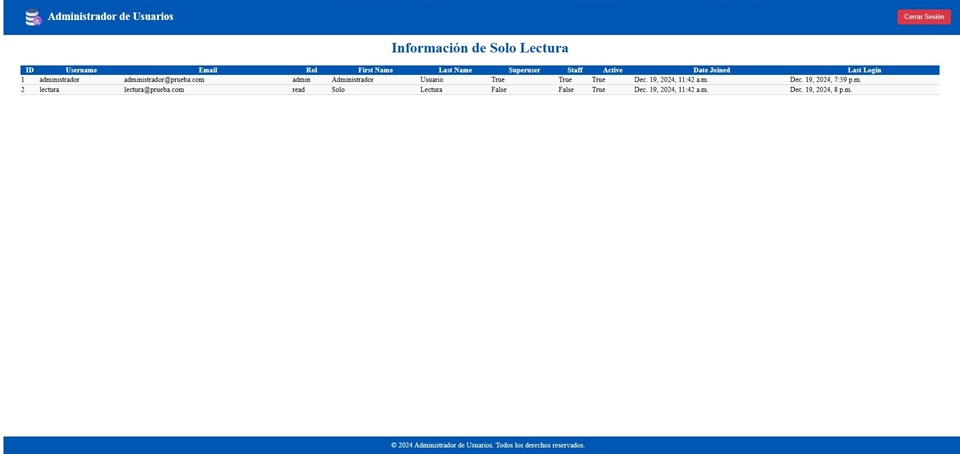
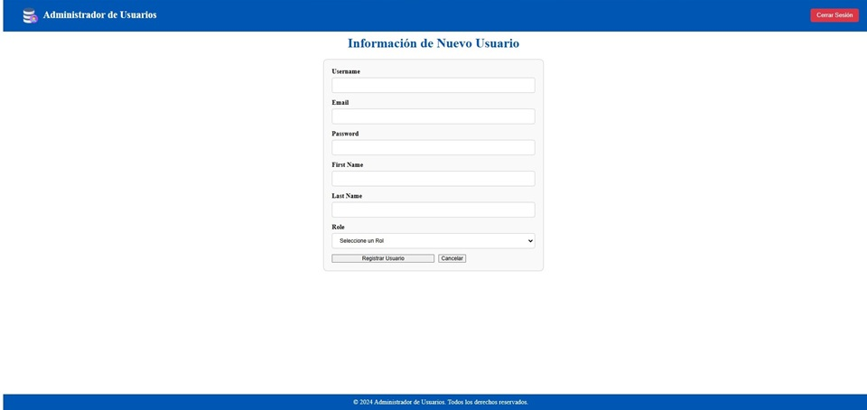

# Proyecto Administrador de Usuarios

Este proyecto combina **Django** y **FastAPI** para crear una plataforma que gestiona usuarios, roles, y ofrece servicios de autenticación y API RESTful. La aplicación está diseñada para ser modular y escalable, lo que permite integraciones y expansiones futuras.

---

## **Estructura del Proyecto**

\05_administrador_usuarios\
├── manage.py                      # Archivo principal para comandos de Django
├── db.sqlite3                     # Base de datos SQLite
├── main.py                        # Archivo principal de FastAPI
├── database.py                    # Configuración de conexión a la base de datos
├── models.py                      # Modelos de FastAPI (SQLAlchemy)
├── schemas.py                     # Validaciones y esquemas con Pydantic
├── backend\                       # Configuración principal del proyecto Django
│   ├── __init__.py
│   ├── asgi.py
│   ├── settings.py                # Configuración principal de Django
│   ├── urls.py                    # Rutas principales de Django
│   └── wsgi.py
├── accounts\                      # App de Django para gestión de usuarios y roles
│   ├── migrations\                # Carpeta generada automáticamente por Django
│   │   └── __init__.py
│   ├── __init__.py
│   ├── admin.py                   # Configuración del panel de administración de Django
│   ├── apps.py
│   ├── models.py                  # Modelos de Django
│   ├── views.py                   # Vistas de Django
│   └── urls.py                    # Rutas específicas de la app
├── templates\                     # Plantillas HTML usadas por Django
│   ├── add_user.html              # Página para agregar un nuevo usuario
│   ├── admin_user_list.html       # Vista del administrador
│   ├── confirm_delete_user.html   # Confirmación para eliminar un usuario
│   ├── edit_user.html             # Página para editar un usuario
│   ├── login.html                 # Página de inicio de sesión
│   ├── read_only_user_list.html   # Vista de solo lectura
│   ├── footer.html                # Footer del proyecto
│   └── header.html                # Header del proyecto
├── static\                        # Archivos estáticos (CSS, imágenes)
│   ├── css\
│   │   └── styles.css             # Estilos personalizados del proyecto
│   └── images\
│       └── logo.png               # Logotipo del proyecto
└── venv\                          # Entorno virtual de Python

---

## **Descripción del Proyecto**

### **Backend**
El backend combina Django y FastAPI para gestionar la autenticación, la asignación de roles y la administración de usuarios. Ofrece una API RESTful mediante FastAPI para interactuar con los datos de roles y usuarios, incluyendo:

- **Gestión de Roles:** CRUD (Crear, Leer, Actualizar, Eliminar) para roles.
- **Gestión de Usuarios:** CRUD para usuarios con validación de contraseñas y asignación de roles.
- **Autenticación:** Uso de tokens JWT para el acceso seguro.

#### **Archivos principales:**
- `main.py`: Define los endpoints principales de FastAPI.
- `database.py`: Configura la conexión a la base de datos SQLite mediante SQLAlchemy.
- `models.py`: Define los modelos de datos para usuarios y roles.
- `schemas.py`: Define los esquemas de validación usando Pydantic.

### **Frontend**
El frontend utiliza Django para proporcionar una interfaz gráfica que incluye:

- **Inicio de sesión:** Formulario de autenticación para acceder a la plataforma.
- **Vistas de administrador y solo lectura separadas:** Página para ver y gestionar usuarios registrados o visualizar en el caso de usuarios de solo lectura.
- **Panel de administración:** Visualización para creación, edición y eliminación de usuarios de acuerdo con el rol de ejecución.

---

## **Requerimientos de la Base de Datos**

La base de datos utiliza SQLite y está diseñada para almacenar información sobre usuarios y roles. Los modelos principales son:

### **Tabla: Roles**
| Campo          | Tipo        | Descripción              |
|----------------|-------------|--------------------------|
| id             | Integer     | Identificador único.     |
| name           | String(255) | Nombre del rol.          |
| description    | Text        | Descripción del rol.     |

### **Tabla: Usuarios**
| Campo          | Tipo        | Descripción                  |
|----------------|-------------|------------------------------|
| id             | Integer     | Identificador único.         |
| username       | String(255) | Nombre de usuario.           |
| email          | String(255) | Correo electrónico único.    |
| password       | String(255) | Contraseña encriptada.       |
| role_id        | Integer     | Relación con la tabla Roles. |
| first_name     | String(255) | Nombre del usuario.          |
| last_name      | String(255) | Apellido del usuario.        |

---

## **Posibles Mejoras**

1. **Integración de un sistema de permisos:** Añadir nuevos permisos personalizados para restringir acciones según roles.
2. **Auditoría de cambios:** Registrar modificaciones realizadas por los usuarios en la base de datos.
3. **Soporte para bases de datos avanzadas:** Migrar a PostgreSQL o MySQL para manejar mayor carga de datos.
4. **Sistema de notificaciones:** Notificar a los usuarios sobre cambios relevantes.
5. **Frontend dinámico:** Integrar un framework como React o Vue.js para mejorar la experiencia del usuario.

---

## **Requisitos del Proyecto**

- Python 3.9
- Django
- FastAPI
- SQLite
- Uvicorn
- SQLAlchemy
- Pydantic
- Bcrypt

Detalle completo en el archivo requirements.txt

---

### **Capturas del proyecto**

A continuación se muestran algunas capturas del proyecto:

- **Inicio de sesión desde PC:**

.jpg)

- **Vista de solo lectura:**

- **Vista de administrador:**

- **Vista de creación de usuario:**

---
